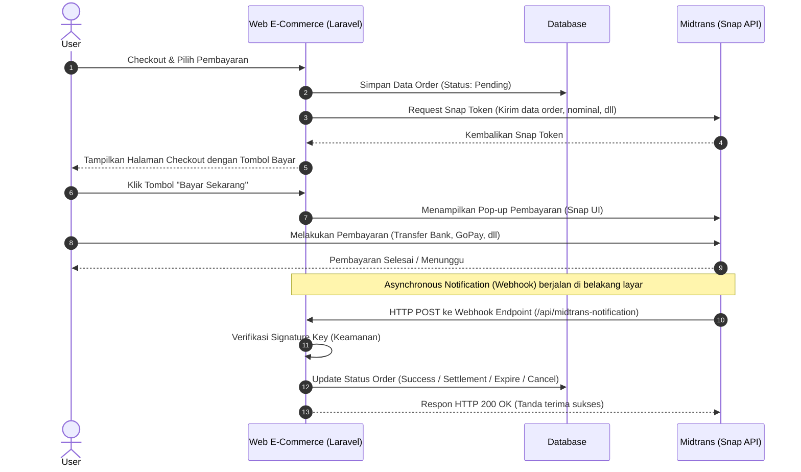
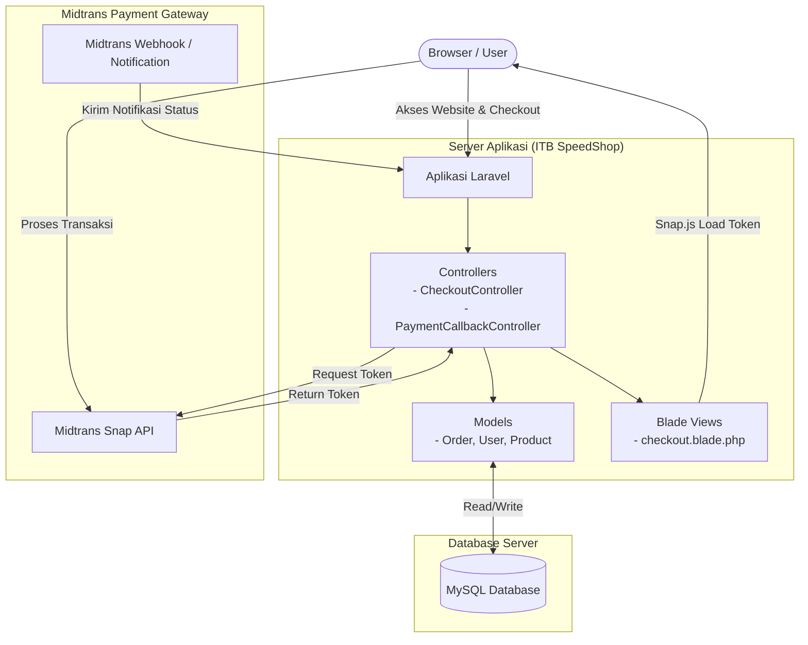

# Diagram Arsitektur Integrasi Midtrans

Berikut adalah diagram arsitektur yang menunjukkan alur integrasi aplikasi E-Commerce (berbasis Laravel) dengan *Payment Gateway* Midtrans.

## Komponen Utama Arsitektur

## Penjelasan Alur Integrasi
1. **Inisiasi Checkout**: Saat user melakukan checkout, aplikasi akan menyimpan data order ke dalam database dengan status `Pending`.
2. **Request Token**: Aplikasi Laravel menggunakan **Midtrans Snap API** untuk mengirimkan detail pembayaran (ID Order, total harga, info user). Midtrans akan membalas dengan sebuah `snap_token`.
3. **Menampilkan UI Pembayaran**: Halaman `checkout.blade.php` akan memuat file javascript dari Midtrans (`snap.js`) dan menggunakan `snap_token` tersebut untuk memunculkan pop-up pilihan metode pembayaran kepada user.
4. **Proses Bayar**: User memilih metode pembayaran (BCA VA, GoPay, Kartu Kredit, dll) dan menyelesaikan transaksi.
5. **Webhook/Notification (Penting)**: Ini adalah jalur utama untuk memastikan kebenaran status pembayaran. Setelah user membayar, Midtrans secara otomatis akan menembak sebuah endpoint di server kita (Webhook) melalui metode `POST`. Server kita akan memvalidasi *signature* dari Midtrans dan mengupdate status pesanan di database menjadi `Settlement` (sukses) atau lainnya.
