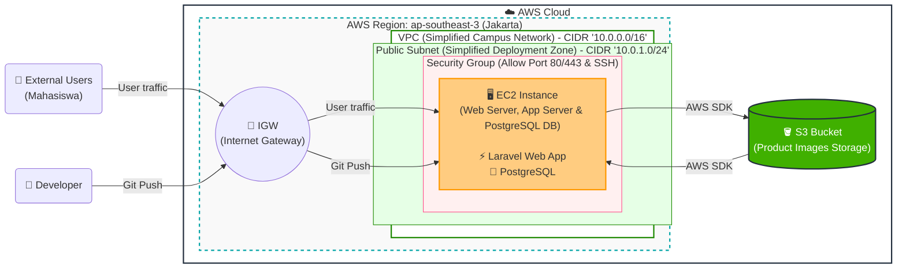

# Diagram Arsitektur AWS

Berikut adalah diagram arsitektur *Deployment* di AWS (diadaptasi dari gambar yang Anda berikan untuk menyesuaikan dengan aplikasi Laravel e-commerce ini).

### Penjelasan Arsitektur:
1. **External Users & Developer**: Pengguna dari luar dan developer mengakses sistem melalui jaringan publik.
2. **IGW (Internet Gateway)**: Sebagai gerbang utama yang menghubungkan jaringan publik (internet) dengan jaringan VPC di AWS.
3. **VPC & Public Subnet**: Jaringan terisolasi (Virtual Private Cloud) dengan konfigurasi CIDR blok untuk mengamankan instance. Karena menggunakan *Simplified Deployment Zone*, EC2 diletakkan pada Public Subnet.
4. **Security Group**: Berfungsi sebagai *firewall* virtual yang hanya membuka port yang diizinkan, yaitu:
   - **Port 80 (HTTP) & 443 (HTTPS)** untuk *User traffic* ke website.
   - **Port 22 (SSH)** untuk Developer (*Git Push* / *Remote access*).
5. **EC2 Instance**: Virtual Machine (Server) yang menjalankan secara sekaligus (*All-in-One*):
   - Web Server (contoh: Nginx/Apache)
   - App Server (Aplikasi Laravel E-Commerce Anda)
   - Database (PostgreSQL)
   *(Sesuai gambar, aslinya Next.js namun diganti ke Laravel agar sesuai dengan tumpukan teknologi project ini).*
6. **S3 Bucket**: Tempat penyimpanan eksternal berkinerja tinggi untuk file gambar produk, diakses oleh aplikasi (EC2) menggunakan *AWS SDK*.
